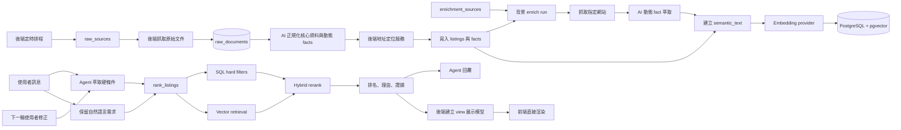

# 物件資料結構與 AI 搜尋流程

## 核心原則

PostgreSQL 是物件資料的唯一儲存與查詢來源。原始來源抓取、AI 正規化、地址定位、enrich 與 embedding 都由 backend pipeline 執行。前端只送出使用者輸入、保存 UI 狀態並照 API 的 `view` 欄位顯示，不參與資料更新。

資料分成兩層：

1. 小型固定核心保留識別、來源、座標與常用硬篩選欄位，讓去重、地圖、SQL 篩選與索引可預期。
2. 其餘物件、環境與外部資料全部放在動態 `facts`。新增資料種類不需要改資料表或前端。

搜尋採混合模式：

1. 價格、縣市、房數、坪數、屋齡、電梯等明確條件使用 SQL 篩選。
2. 採光、安靜、生活感受、格局偏好等自然語言使用向量相似度召回。
3. 後端以結構化分數和語意分數重排。
4. Agent 只取得排名結果與證據，再產生回答。

## 原始資料管線

### `raw_sources`

| 欄位 | 用途 |
| --- | --- |
| `id`、`name` | 來源識別與名稱 |
| `start_url` | 定時抓取入口 |
| `document_mode` | `single`、`json` 或從入口發現 `links` |
| `link_pattern` | 詳細頁 URL 的正規表示式 |
| `max_documents` | 單次最多抓取文件數 |
| `default_mode` | 來源固定為買賣或租賃時的預設值 |
| `headers` | 來源要求的 HTTP headers |
| `refresh_minutes` | 更新週期 |
| `last_run_at`、`next_run_at` | 排程狀態 |

來源設定只描述如何取得原始文件，不描述物件欄位。新增來源時不需要為樓層、電梯或其他內容撰寫欄位 mapping。

### `raw_documents`

保存原始 URL、content type、未修改內容、hash、AI 正規化結果、模型版本與處理狀態。同一內容在同一模型下不會重複呼叫 AI；切換模型後可以重新正規化。

### `ingestion_jobs`

保存每次排程的 `running`、`completed`、`completed_with_errors` 或 `failed` 狀態、數量摘要與錯誤。

## PostgreSQL `listings`

### 識別與來源

| 欄位 | 型別 | 用途 |
| --- | --- | --- |
| `id` | `text` | 物件主鍵 |
| `source` | `text` | 資料來源 |
| `source_id` | `text` | 來源端識別碼 |
| `mode` | `sale \| rent` | 買賣或租賃 |
| `url` | `text` | 原始資料網址 |
| `scraped_at` | `timestamptz` | 抓取時間 |
| `content_hash` | `text` | 判斷資料是否需要重新向量化 |
| `indexed_at` | `timestamptz` | 最近索引時間 |

### 結構化物件資料

| 欄位 | 型別 | 用途 |
| --- | --- | --- |
| `title`、`description` | `text` | 標題與原始描述 |
| `city`、`district`、`address` | `text` | 行政區與地址 |
| `lat`、`lng` | `double precision` | 座標 |
| `geocode_source` | `text` | `nominatim`、衍生行政區重心或來源提供 |
| `geocode_precision` | `text` | `exact`、`approximate` 或 `unknown` |
| `geocode_matched_address` | `text` | 定位服務實際匹配的地址 |
| `price`、`unit_price` | `double precision` | 總價與單價 |
| `area`、`rooms`、`layout` | 數值／文字 | 坪數與格局 |
| `floor`、`total_floor` | `integer` | 所在樓層與總樓層 |
| `age` | `double precision` | 屋齡 |
| `building_type` | `text` | 建物型態 |
| `has_elevator`、`has_parking` | `boolean` | 電梯與車位 |

### 動態 facts

| 欄位 | 型別 | 用途 |
| --- | --- | --- |
| `facts` | `jsonb` array | 所有可擴充的物件、交通、氣候、治安、災害與生活機能事實 |
| `details` | `jsonb` | 舊爬蟲輸入相容欄位，ingest 時會轉成 facts |
| `features` | `jsonb` | 舊衍生特徵相容欄位，ingest 時會轉成 facts |

每個 fact 使用下列結構：

```json
{
  "key": "annualRainfall",
  "label": "年雨量",
  "group": "氣候",
  "value": 2350,
  "displayValue": "2,350 毫米",
  "unit": "毫米",
  "sourceName": "中央氣象署",
  "sourceUrl": "https://example.gov.tw/data",
  "observedAt": "2026-09-29T08:00:00.000Z",
  "confidence": 0.96,
  "evidence": "年平均降雨量 2350 mm"
}
```

`key` 不受預先列舉限制。查不到的資料不建立 fact。需要高頻精確篩選或排序的 fact，可再建立 JSON expression index 或投影為固定欄位；不需要先為所有可能資料設計 schema。

### 搜尋欄位

| 欄位 | 型別 | 用途 |
| --- | --- | --- |
| `semantic_text` | `text` | 將物件事實整理成適合 embedding 的文字 |
| `embedding` | `vector(1536)` | 語意向量 |
| `embedding_model` | `text` | 產生向量的模型版本 |
| `search_document` | `tsvector` | 關鍵字索引 |

向量使用 cosine distance 與 HNSW index。`content_hash` 未改變時，匯入器不會重算 embedding。

## API 搜尋輸入

`POST /listings/search`

```json
{
  "profile": {
    "mode": "sale",
    "weights": {
      "price": 70,
      "value": 60,
      "weather": 30,
      "location": 80,
      "amenities": 50,
      "space": 70,
      "quality": 80,
      "hazard": 60
    },
    "hard": {
      "cities": ["臺北市"],
      "budgetMax": 2500,
      "minRooms": 3,
      "needElevator": true
    }
  },
  "semanticQuery": "希望高樓層、採光好、安靜，客廳不要太暗",
  "limit": 100
}
```

## 搜尋結果

每筆結果包含計算資料與可直接顯示的 `view`：

| 欄位 | 用途 |
| --- | --- |
| `score` | 混合排序總分，範圍 0 到 1 |
| `semanticScore` | 向量相似度 |
| `breakdown` | 價格、性價比、氣候、交通、機能、空間、屋況、風險分項 |
| `matchReasons` | 可向使用者說明的匹配理由 |
| `details` | 爬蟲擷取的細節與證據 |
| `facts` | 後端合併完成的動態事實與來源資訊 |
| `dataGaps` | 缺少的資料 |
| `view.score` | 已完成的星等文字與填滿比例 |
| `view.scores` | 已排序並格式化的分項評分 |
| `view.cardFacts` | 地圖與清單卡片可直接渲染的 label/value |
| `view.detailFacts` | 右欄可直接渲染的所有細項 |
| `view.marker` | 地圖 marker 的文字、顏色、尺寸與層級 |
| `view.action` | 查看原始物件的按鈕文字與網址 |

有語意文字時，總分目前為結構化分數 60% 加語意分數 40%；沒有語意文字時只使用結構化分數。

## 資料流



### 寫入流程

1. 後端依 `raw_sources.next_run_at` 選擇到期來源。
2. 抓取入口文件；`links` 模式依 `link_pattern` 找出詳細頁。
3. 原始內容先寫入 `raw_documents`，因此後續失敗不會遺失來源資料。
4. AI 從任意 HTML、JSON、CSV 或文字同時萃取最小核心欄位與不限種類的 facts。
5. 缺少的欄位直接省略；沒有可定位地址的物件保留在 raw document 並記錄錯誤，不進入可搜尋資料。
6. 後端地址服務查 PostgreSQL 快取，未命中才依預算查 Nominatim。
7. 可定位物件寫入 `listings`，再依已知地址與座標執行所有已啟用 enrichment sources。
8. 外部資料由 AI 轉成帶來源、觀測時間、信心度與證據的 facts。
9. 合併 facts 後建立 `semantic_text` 與 embedding，物件即可搜尋。

### 查詢流程

1. Agent 將明確限制寫入 session preference state。
2. Agent 將使用者原始描述放入 `rank_listings.semanticQuery`。
3. 後端先用 SQL 套用 hard constraints。
4. 有 `semanticQuery` 時，用相同 embedding provider 建立查詢向量並做 cosine search。
5. 後端計算八個結構化分項，再與語意分數合併排序。
6. 後端建立完整 `view`，同一批結果透過 SSE 傳給前端，也以精簡投影交給 Agent 生成回答。
7. 下一輪對話沿用 session preference，再以新訊息重新搜尋。

### 外部網站 enrich 流程

1. `PUT /enrichment/sources/:id` 登錄資料來源名稱、URL 模板、範圍、必要 core/fact keys 與啟用狀態。
2. URL 模板可使用 `{id}`、`{address}`、`{city}`、`{district}`、`{lat}`、`{lng}`；替換值會做 URL encoding。
3. 後端只對具備 `requires` 所列資料的物件使用該工具，例如已有座標才查座標型資料、已有行政區才查區域統計。
4. `POST /enrichment/run` 可指定 `sourceIds`、`listingIds` 與本次 `limit`，供排程或資料更新腳本呼叫。
5. 後端抓取 HTML、JSON 或文字，移除頁面程式與樣式後送入 AI。
6. AI 只輸出有原文證據的 facts。後端補上來源名稱、URL、觀測時間與來源 ID。
7. 同來源再次執行時會替換該來源舊 facts，其他來源資料保留。
8. facts 更新後立即重建 `semantic_text` 與 embedding，下一次查詢即可使用。
9. `enrichment_runs` 保存每次物件與來源的成功、失敗、URL、fact 數量與錯誤。

### Pipeline API 與排程

登錄來源：

```http
PUT /pipeline/sources/example-source
Content-Type: application/json

{
  "name": "範例房屋來源",
  "startUrl": "https://example.com/homes",
  "documentMode": "links",
  "linkPattern": "/home/[0-9]+$",
  "maxDocuments": 20,
  "defaultMode": "sale",
  "headers": {},
  "enabled": true,
  "refreshMinutes": 1440
}
```

手動執行指定來源：

```http
POST /pipeline/run
Content-Type: application/json

{"sourceIds":["example-source"]}
```

`GET /pipeline/jobs` 查看最近執行狀態。backend process 預設每 60 秒檢查一次到期來源；設定 `PIPELINE_POLL_INTERVAL_MS=0` 可停用自動排程。

## Embedding 模式

| 模式 | 設定 | 用途 |
| --- | --- | --- |
| 離線 hash n-gram | `EMBEDDING_MODE=hash` | 無金鑰即可啟動與驗證整條向量流程，效果偏關鍵字相似 |
| OpenAI 相容 API | `EMBEDDING_MODE=openai` | 正式語意搜尋，需設定 base URL、API key 與 1536 維模型 |

正式使用應選真正的 embedding 模型。切換模型後要更新 `EMBEDDING_MODEL` 並重新執行完整索引；目前資料表固定為 1536 維。

## AI 細節萃取

`DETAIL_EXTRACTION_MODE=auto` 會優先使用獨立的 `DETAIL_EXTRACTION_API_KEY`，其次使用 `GEMINI_API_KEY`，都沒有時關閉萃取。也可指定 `openai`、`google` 或 `off`。

來源直接提供的 facts 優先於 AI 從原始描述萃取的同 key fact。AI 只能根據輸入內容擷取，未知資料直接省略，`evidence` 保存判斷依據的原文。背景網站 enrich 也使用相同動態 fact 格式並補上來源追蹤資訊。

## 執行方式

容器流程：

```bash
docker compose up --build
```

標準啟動不執行 frontend 資料工具；先用 `/pipeline/sources/:id` 登錄來源，後端排程會自行抓取。舊資料集工具只供過渡相容：

```bash
docker compose --profile legacy-data run --rm data-init
docker compose --profile tools run --rm data-refresh
```

本機流程：

```bash
cd backend
pnpm db:migrate
pnpm dev
```

舊資料集相容匯入可在另一個終端執行：

```bash
cd frontend
INGEST_URL=http://127.0.0.1:3001/listings/ingest pnpm db:seed
pnpm dev
```
